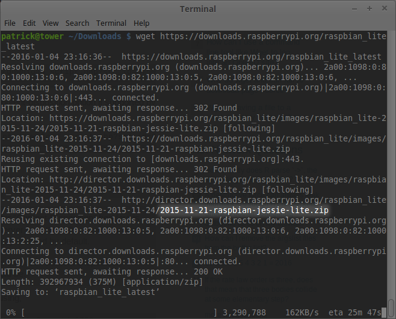

Raspbian Weather Station
========================


### Setup

#### Assembly


**TODO: block diagram**


**TODO: picture of enclosure, opened up**


#### SD Card Preparation

If your microSD card is not preloaded with Raspbian Jessie Lite, select the
appropriate instructions from the [official guide][img-install]. For this
section only, we will continue assuming you have a Debian-like system 
(Linux Mint, Ubuntu, ...).

Download the latest **Raspbian Jessie Lite** image from 
<https://raspberrypi.org/downloads/raspbian/>

```
user@linux:~ $ cd Downloads
user@linux:~/Downloads $ wget https://downloads.raspberrypi.org/raspbian_lite_latest
...lots of output...
```

`wget` creates a new file named `raspbian_lite_latest` instead of using
the actual file name. You can check the actual file name from the end of
the redirection URL in the wget output (highlighted):



Extract the downloaded file.

```
user@linux:~/Downloads $ unzip raspbian_lite_latest
Archive:  raspbian_lite_latest
  inflating: 2015-11-21-raspbian-jessie-lite.img
```

If you haven't already, plug in your microSD card and identify its file system
path using `df`. You can run the command before and after plugging the microSD
card in, if you have trouble identifying it. In our case, the target path is
`/dev/sdb` (it excludes the partition number).

```
user@linux:~/Downloads $ df
Filesystem              1K-blocks    Used Available Use% Mounted on
  ...                     ...        ...     ...    ...     ...
  lots of system-dependent drives listed
  ...                     ...        ...     ...    ...     ...
/dev/sda1                  240972   47068    181463  21% /boot
/dev/sdb1                 3864064      96   3863968   1% /media/user/3366-3535
```

Ensure the drive is unmounted. The `umount` command requires the mount point
path, which for us is `/media/user/3366-3535` (not the file system path).

```
user@linux:~/Downloads $ sudo umount /media/user/3366-3535
[sudo] password for user:
```

Finally, write the image to the microSD card. The `dd` command does not produce
output until it finishes, so wait a few minutes. From experience, the `bs=4M`
argument is a good idea. The input file `if` is the extracted image and the
output file `of` is the microSD file system path.

```
user@linux:~/Downloads $ sudo dd bs=4M if=2015-11-21-raspbian-jessie-lite.img of=/dev/sdb

```

Before removing the microSD card, issue the `sync` command to ensure all
buffers are written to disk. The card is now ready to boot in the Raspberry Pi.

```
user@linux:~/Downloads $ sudo sync
```

  [img-install]: https://www.raspberrypi.org/documentation/installation/installing-images/README.md


#### Initial OS Setup

Run `sudo raspi-config` after logging in (`pi`/`raspberry`) to start the
initial setup utility.

> *If you have already connected the device to the Pi, you may see horrible
> errors covering your screen after boot. Try pressing 'Enter' several
> times to get a visible login prompt.*

* Expand Filesystem
    * Yes
* Change User Password
    * Yes
* Internationalization
    * Set your preferred locale (we use `en_US.UTF-8`)
    * Set your time zone (we use `GMT+8` for Pacific Standard Time year-round;
      the inverted sign (+8) is a POSIX quirk)
    * Set your keyboard (we use US English)
* Overclock
    * 800 Mhz (modest)
    * (or don't, it's not required)
* Advanced Options
    * Set the hostname (we use `airmar200wx`)
    * Enable SSH
    * Disable serial shell/kernel messages (to repurpose UART for serial input)
* Exit saving changes and reboot

Login, then fetch and apply system updates. The `dist-upgrade` command goes
further than `upgrade` by resolving dependencies and removing stale packages. 
Since we're starting fresh, it makes more sense. 

```
pi@airmar200wx:~ $ sudo apt-get update
...
pi@airmar200wx:~ $ sudo apt-get dist-upgrade -y
...
```

Next fetch and apply firmware updates. The firmware is independent of the
system packages and must be updated seperately. Unfortunately, Jessie Lite
doesn't come with the updater package, `rpi-update`, so you must install it 
first.

```
pi@airmar200wx:~ $ sudo apt-get install rpi-update -y
...
pi@airmar200wx:~ $ sudo rpi-update
...
```

It should update without errors and advise you to reboot. Enter `sudo reboot`
to proceed.

#### *kplex* Setup

*kplex* is a NMEA multiplexing server; it's used to rebroadcast the Airmar
200WX data stream via TCP socket.

##### Create Account

Create a user for *kplex* to run under. It requires system privileges to run
as a service and the group list should include `dialout` so it receives R/W
permission to the hardware serial port. A home directory (`/home/kplex`) will
be created automatically.

```
pi@airmar200wx:~ $ sudo adduser --system --group kplex,dialout
Adding system user `kplex' (UID 109) ...
Adding new group `kplex' (GID 113) ...
Adding new user `kplex' (UID 109) with group `kplex' ...
Creating home directory `/home/kplex' ...
pi@airmar200wx:~ $ ls /home
kplex  pi
```

##### Clone and Build

Next clone the repository over the new home directory, retaining file
ownership. Change to that directory and start the build. Since the 'pi' 
user doesn't have write access to the 'kplex' user's home directory, 
use `sudo` and masquerade as the new 'kplex' user.

```
pi@airmar200wx:~ $ sudo -u kplex git clone https://github.com/stripydog/kplex /home/kplex
Cloning into `/home/kplex`...
remote: Counting objects: 812, done.
Receiving objects: 100% (812/812), 272.18 KiB | 258.00 KiB/s, done.
remote: Total 812 (delta 0), reused 0 (delta 0), pack-reused 812
Resolving deltas: 100% (595/595), done.
Checking connectivity... done.
pi@airmar200wx:~ $ cd /home/kplex
pi@airmar200wx:/home/kplex $ sudo -u kplex make
cc -g -Wall   -c -o kplex.o kplex.c
cc -g -Wall   -c -o fileio.o fileio.c
cc -g -Wall   -c -o serial.o serial.c
cc -g -Wall   -c -o bcast.o bcast.c
cc -g -Wall   -c -o tcp.o tcp.c
cc -g -Wall   -c -o options.o options.c
cc -g -Wall   -c -o error.o error.c
cc -g -Wall   -c -o lookup.o lookup.c
cc -g -Wall   -c -o mcast.o mcast.c
cc -g -Wall   -c -o gofree.o gofree.c
cc -g -Wall   -c -o udp.o udp.c
cc -o kplex kplex.o fileio.o serial.o bcast.o tcp.o options.o error.o lookup.o mcast.o gofree.o udp.o -pthread -lutil
```

With a successful build, the file can be installed. Default location is
`/usr/bin`. (There's no need to continue masquerading as kplex.) You can
verify the install location using `which`.

```
pi@airmar200wx:/home/kplex $ sudo make install
test -d "//usr/bin" || install -d -g root -o root -m 755 //usr/bin
Install -g root -o root -m 755 kplex //usr/bin/kplex
pi@airmar200wx:/home/kplex $ which kplex
/usr/bin/kplex
```

##### Set Configuration

Create the configuration file expected by the service:

```
pi@airmar200wx:/home/kplex $ sudo cp kplex.conf.ex /etc/kplex.conf
pi@airmar200wx:/home/kplex $ sudo nano kplex.conf
```
```
...
[serial]
filename=/dev/ttyAMA0
direction=both
baud=4800

[tcp]
mode=server
port=10110
direction=out
```

##### Install as Service

Create a service from the executable:

```
pi@airmar200wx:/home/kplex $ sudo nano /etc/systemd/system/kplex.service
```
```
[Unit]
Description=kplex (NMEA multiplexer)
After=syslog.target network.target

[Service]
Type=simple
User=kplex
Group=kplex
ExecStart=/usr/bin/kplex

[Install]
WantedBy=multi-user.target
```

Finally, enable the service to start at boot:

```
pi@airmar200wx:/home/kplex $ sudo systemctl enable kplex
Created symlink from /etc/systemd/system/multi-user.target.wants/kplex.service to /etc/systemd/system/kplex.service
pi@airmar200wx:/home/kplex $ sudo systemctl start kplex
```

Reboot - works. 

#### RPi-Monitor Setup


***TODO***


#### Samba (SMB) Setup

Install samba for sharing data:

```
pi@airmar200wx:~ sudo apt-get install samba samba-common-bin -y
...
```

Edit shares:

```
pi@airmar200wx: ~ $ sudo nano /etc/samba/smb.conf
```


